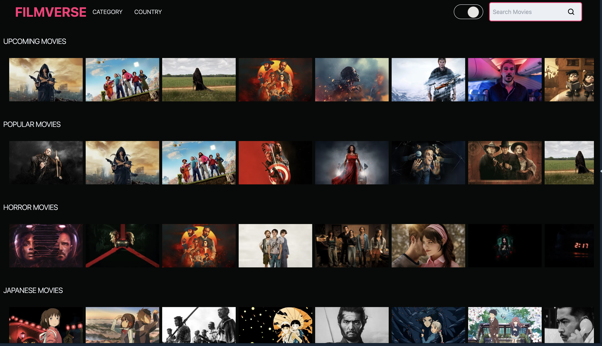

# 🎬 FilmVerse

**FilmVerse** is a simple and user-friendly movie discovery site built with **React** and **TypeScript**, using data from the [TMDB API](https://www.themoviedb.org/documentation/api).

🌐 **Live Site:** [https://filmverse-tmdb.netlify.app](https://filmverse-tmdb.netlify.app)

## 📚 What You Can Do

- 🔍 Search for movies by title
- 🎞️ Browse upcoming releases
- ⭐ See popular and trending titles
- 😱 Discover horror movies and more genres
- 🇯🇵 Explore Japanese cinema
- 📋 View detailed movie info: synopsis, rating, release date, and more

## 💡 Tech Highlights

- Built with **React + TypeScript**
- Styled with **TailwindCSS** (if applicable)
- Powered by the **TMDB API**
- Hosted on **Netlify**

## 📸 Screenshot

## 📄 License

This project is open source and available under the [MIT License](LICENSE).
